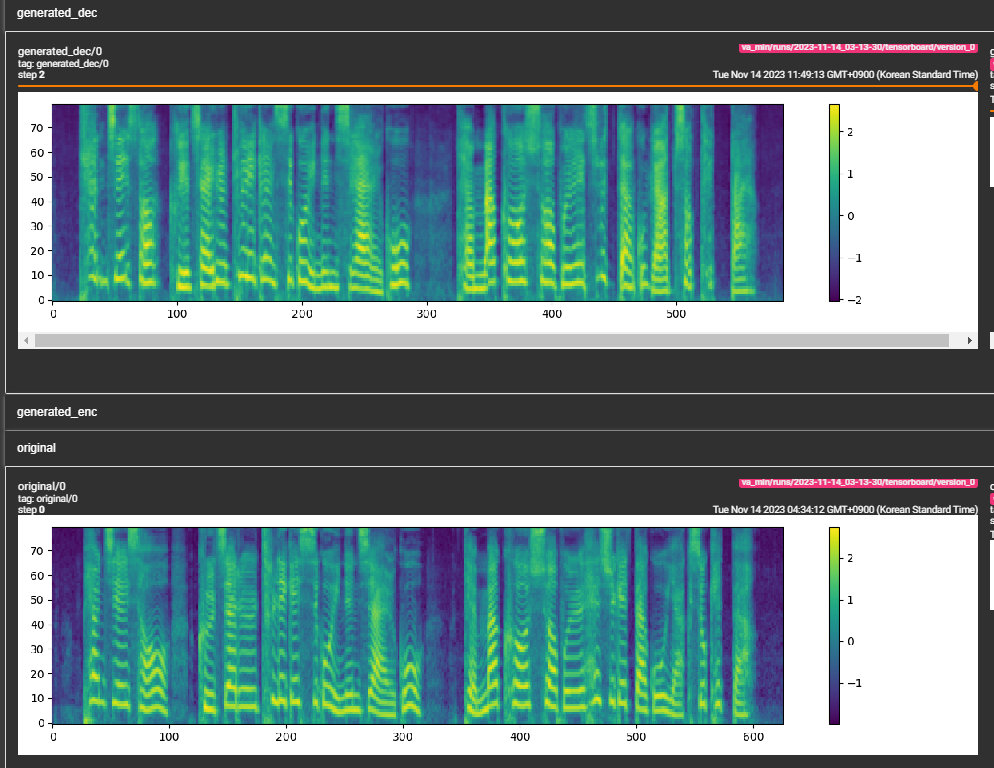
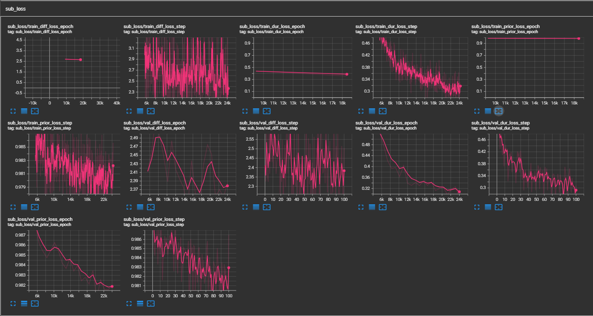

## P-Flow: A Fast and Data-Efficient Zero-Shot TTS through Speech Prompting
### Authors : Sungwon Kim, Kevin J Shih, Rohan Badlani, Joao Felipe Santos, Evelina Bhakturina, Mikyas Desta, Rafael Valle, Sungroh Yoon, Bryan Catanzaro
#### Affiliations: NVIDIA

## Status : Added newer samples with better prosody and pronunciation. Check out `samples` folder. LJSpeech pretrained ckpt - [GDrive Link](https://drive.google.com/drive/folders/1x-A2Ezmmiz01YqittO_GLYhngJXazaF0?usp=sharing)

Unofficial implementation of the paper [P-Flow: A Fast and Data-Efficient Zero-Shot TTS through Speech Prompting](https://openreview.net/pdf?id=zNA7u7wtIN) by NVIDIA.


While recent large-scale neural codec language models have shown significant improvement in zero-shot TTS by training on thousands of hours of data, they suffer from drawbacks such as a lack of robustness, slow sampling speed similar to previous autoregressive TTS methods, and reliance on pre-trained neural codec representations. Our work proposes P-Flow, a fast and data-efficient zero-shot TTS model that uses speech prompts for speaker adaptation. P-Flow comprises a speechprompted text encoder for speaker adaptation and a flow matching generative decoder for high-quality and fast speech synthesis. Our speech-prompted text encoder uses speech prompts and text input to generate speaker-conditional text representation. The flow matching generative decoder uses the speaker-conditional output to synthesize high-quality personalized speech significantly faster than in real-time. Unlike the neural codec language models, we specifically train P-Flow on LibriTTS dataset using a continuous mel-representation. Through our training method using continuous speech prompts, P-Flow matches the speaker similarity performance of the large-scale zero-shot TTS models with two orders of magnitude less training data and has more than 20× faster sampling speed. Our results show that P-Flow has better pronunciation and is preferred in human likeness and speaker similarity to its recent state-of-the-art counterparts, thus defining P-Flow as an attractive and desirable alternative.

## Credits
- Of course the kind author of the paper for taking some time to explain me some details of the paper that I didn't understand at first. 
- We will build this repo based on the [VITS2 repo](https://github.com/p0p4k/vits2_pytorch), [MATCHA-TTS repo](https://github.com/shivammehta25/Matcha-TTS/) and [VoiceFlow-TTS repo](https://github.com/cantabile-kwok/VoiceFlow-TTS)

# Dry run
``` sh
cd pflowtts_pytorch/notebooks
```
``` python
import sys
sys.path.append('..')

from pflow.models.pflow_tts import pflowTTS
import torch
from dataclasses import dataclass

@dataclass
class DurationPredictorParams:
    filter_channels_dp: int
    kernel_size: int
    p_dropout: float

@dataclass
class EncoderParams:
    n_feats: int
    n_channels: int
    filter_channels: int
    filter_channels_dp: int
    n_heads: int
    n_layers: int
    kernel_size: int
    p_dropout: float
    spk_emb_dim: int
    n_spks: int
    prenet: bool

@dataclass
class CFMParams:
    name: str
    solver: str
    sigma_min: float

# Example usage
duration_predictor_params = DurationPredictorParams(
    filter_channels_dp=256,
    kernel_size=3,
    p_dropout=0.1
)

encoder_params = EncoderParams(
    n_feats=80,
    n_channels=192,
    filter_channels=768,
    filter_channels_dp=256,
    n_heads=2,
    n_layers=6,
    kernel_size=3,
    p_dropout=0.1,
    spk_emb_dim=64,
    n_spks=1,
    prenet=True
)

cfm_params = CFMParams(
    name='CFM',
    solver='euler',
    sigma_min=1e-4
)

@dataclass
class EncoderOverallParams:
    encoder_type: str
    encoder_params: EncoderParams
    duration_predictor_params: DurationPredictorParams

encoder_overall_params = EncoderOverallParams(
    encoder_type='RoPE Encoder',
    encoder_params=encoder_params,
    duration_predictor_params=duration_predictor_params
)

model = pflowTTS(
    n_vocab=100,
    n_feats=80,
    encoder=encoder_overall_params,
    decoder=None,
    cfm=cfm_params,
    data_statistics=None,
)

x = torch.randint(0, 100, (4, 20))
x_lengths = torch.randint(10, 20, (4,))
y = torch.randn(4, 80, 500)
y_lengths = torch.randint(300, 500, (4,))

dur_loss, prior_loss, diff_los, attn = model(x, x_lengths, y, y_lengths)
# backpropagate the loss 

# now synthesises
x = torch.randint(0, 100, (1, 20))
x_lengths = torch.randint(10, 20, (1,))
y_slice = torch.randn(1, 80, 264)

model.synthesise(x, x_lengths, y_slice, n_timesteps=10)
```
# Quick run in Google Colab
[](https://colab.research.google.com/drive/1tyWDhqfP8ff5O4YcSv9S7TgSpiEyzIvz?usp=sharing)

# Instructions to run
0. Create an environment (suggested but optional)
``` sh
conda create -n pflowtts python=3.10 -y
conda activate pflowtts
```

Stay in the root directory (of course clone the repo first!)
``` sh
cd pflowtts_pytorch
pip install -r requirements.txt
```

1. Build Monotonic Alignment Search 
```sh
# Cython-version Monotonoic Alignment Search
python setup.py build_ext --inplace
```

Let's assume we are training with LJ Speech

2. Download the dataset from [here](https://keithito.com/LJ-Speech-Dataset/), extract it to `data/LJSpeech-1.1`, and prepare the file lists to point to the extracted data like for [item 5 in the setup of the NVIDIA Tacotron 2 repo](https://github.com/NVIDIA/tacotron2#setup).

3a. Go to `configs/data/ljspeech.yaml` and change
```yaml
train_filelist_path: data/filelists/ljs_audio_text_train_filelist.txt
valid_filelist_path: data/filelists/ljs_audio_text_val_filelist.txt
```
3b. Helper commands for the lazy 
```sh
!mkdir -p /home/ubuntu/LJSpeech/LJSpeech-1.1/filelists
!wget -O /home/ubuntu/LJSpeech/LJSpeech-1.1/filelists/ljs_audio_text_test_filelist.txt https://raw.githubusercontent.com/NVIDIA/tacotron2/master/filelists/ljs_audio_text_test_filelist.txt
!wget -O /home/ubuntu/LJSpeech/LJSpeech-1.1/filelists/ljs_audio_text_train_filelist.txt https://raw.githubusercontent.com/NVIDIA/tacotron2/master/filelists/ljs_audio_text_train_filelist.txt
!wget -O /home/ubuntu/LJSpeech/LJSpeech-1.1/filelists/ljs_audio_text_val_filelist.txt https://raw.githubusercontent.com/NVIDIA/tacotron2/master/filelists/ljs_audio_text_val_filelist.txt

!sed -i -- 's,DUMMY,/home/ubuntu/LJSpeech/LJSpeech-1.1/wavs,g' /home/ubuntu/LJSpeech/LJSpeech-1.1/filelists/*.txt

!sed -i -- 's,train_filelist_path: data/filelists/ljs_audio_text_train_filelist.txt,train_filelist_path: /home/ubuntu/LJSpeech/LJSpeech-1.1/filelists/ljs_audio_text_train_filelist.txt,g' /home/ubuntu/LJSpeech/pflowtts_pytorch/configs/data/ljspeech.yaml
!sed -i -- 's,valid_filelist_path: data/filelists/ljs_audio_text_val_filelist.txt,valid_filelist_path: /home/ubuntu/LJSpeech/LJSpeech-1.1/filelists/ljs_audio_text_val_filelist.txt,g' /home/ubuntu/LJSpeech/pflowtts_pytorch/configs/data/ljspeech.yaml
```
4. Generate normalisation statistics with the yaml file of dataset configuration

```bash
cd pflowtts_pytorch/pflow/utils
python generate_data_statistics.py -i ljspeech.yaml
# Output:
#{'mel_mean': -5.53662231756592, 'mel_std': 2.1161014277038574}
```

Update these values in `configs/data/ljspeech.yaml` under `data_statistics` key.

```bash
data_statistics:  # Computed for ljspeech dataset
  mel_mean: -5.536622
  mel_std: 2.116101
```
to the paths of your train and validation filelists.

5. Run the training script

```bash
make train-ljspeech
```

or

```bash
python pflow/train.py experiment=ljspeech
```

- for multi-gpu training, run

```bash
python pflow/train.py experiment=ljspeech trainer.devices=[0,1]
```

## Architecture details
- [x] Speech prompted text encoder with Prenet and RoPE Transformer
- [x] Duration predictor with MAS
- [x] Flow matching generative decoder with CFM (paper uses wavenet decoder; we use modified wavenet and optional U-NET decoder is included to experiment with)
- [x] Speech prompt input currently slices the input spectrogram and concatenates it with the text embedding. Can support external speech prompt input (during training as well)
- [x] pflow prompt masking loss for training
- [x] HiFiGan for vocoder

## TODOs, features and update notes
- [x] (11/12/2023) Currently it is an experimental repo with many features substituted with quick architecture implementations I found online. I will add the original architectures soon.
- [x] (11/12/2023) Check out `notebooks` for a quick dry run and architecture testing of the model.
- [x] ~(11/12/2023) Training fails on my dataset at the moment, will debug and fix it soon. But the training the code runs error-free.~
- [x] (11/13/2023) 
    - fixed big mistake in monotonic align build
    - lot of combinations possible within model
    - architecture big picture is same like paper, but internals are different
    - if model doesnt converge, will eventually settle to paper's exact architecture
- [x] (11/13/2023) Tensorboard screenshot
    
- [x] (11/13/2023)
    - added installation instructions
- [x] (11/13/2023)
    - looks like the model is learning and is on the right track. 
    
- [x] (11/14/2023)
    
- [x] (11/14/2023)
    - added Google Colab notebook for quick run
- [x] (11/16/2023)
    - added sample audio
    - some architecture changes
    - we know the model learns, now we need to try multispeaker and check for prosody.
- [x] (11/17/2023)
    - added 3 new branches ->
        - dev/stochastic -> some changes to posterior sampling and text encoder (prior) to make it stochastic
        - dev/encodec -> predicts encodec continuous latent instead of mel spectrogram; if works, use encodec for decoding instead of hifi-gan
        - exp/end2end -> end to end training of pflow with hi-fi gan to generate audio directly from text and speech prompt input; if it works, vits-tts will be obsolete.
- [x] (11/17/2023)
    - 24 epochs encodec sample (although robotic, it is a proof of concept) [encodec_poc.wav](encodec_poc.wav)
- [x] (11/20/2023)
    - Model is more or less ready.
    - Added 3 choices for estimators, need to make them into hyperparameters and add them to the config file.
    - Thanks to [@zidsi](https://github.com/zidsi) for pointing out typos in the code.
- [x] (11/23/2023)
    - Added newer samples with better prosody and pronunciation. Check out `samples` folder. (LJSpeech trained for 300k steps) _Paper recommends 800k steps._
- [x] Anyone is welcome to contribute to this repo. Please feel free to open an issue or a PR.
